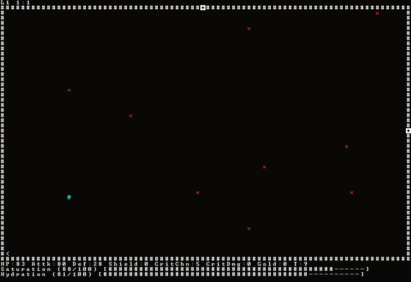

# Welcome to Wayventure's development branch!

### For upcoming releases/features please refer [here](https://app.simplenote.com/p/kkFf1V)  
  
*Sorry for the low framerate, I had to compress the GIF*

### Installation instructions:
Dependencies: g++, make, [libtcod](https://github.com/libtcod/libtcod), [SDL2](https://www.libsdl.org/download-2.0.php)

```
Build instructions: make
Run ./project-cosmos to start playing
```

Please open an issue if you would like to contribute code, advise or simply just requesting new features!  

### Press 'Shift+h' to learn about the keybindings while the wiki will be developed later on after the v1.2.0 release